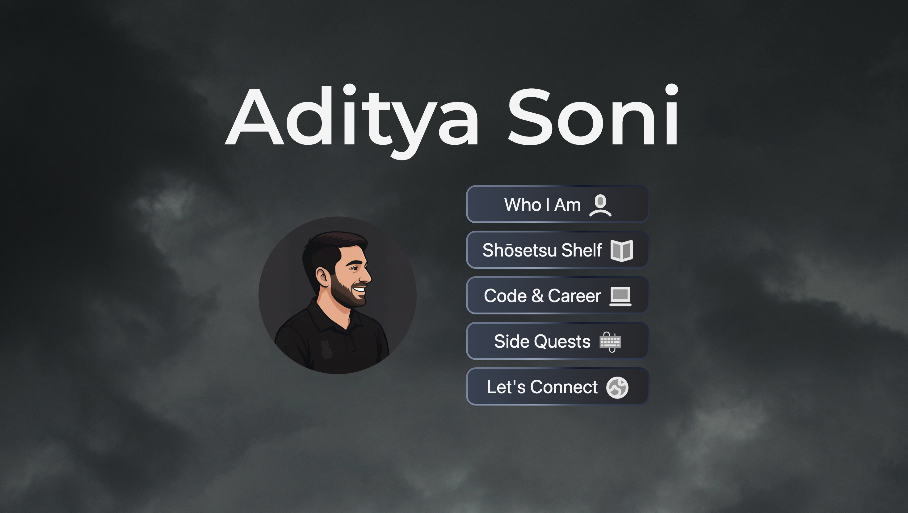

# Aditya Soni - Portfolio 😁

🚀 **Live:** [adityasoni.dev](https://adityasoni.dev)

A website about me and everything I love. Please have a look around. Cheers!

## 💡 Features

- 🎨 Clean and minimal, mobile-friendly design
- 📚 Bookshelf gallery with relevant links for (Japanese) reading recommendations
- 😷 About section with introduction, highlighting skills, and hobbies
- 💻 Work experience and projects section
- 🔗 Links to my social media (instagram, linkedin, etc.)

## Tech Stack

| Category | Technologies |
|-----------|--------------|
| **Frontend** | React, React Router v7, Tailwind CSS, Vite |
| **Backend** | Node.js, Cloudflare |
| **Database** | Cloudflare D1 and R2 |
| **Deployment** | Cloudflare Workers |

### Preview Image

---

